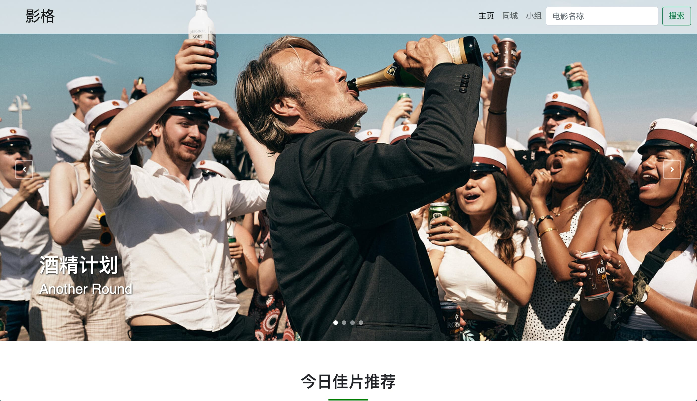

# 设计说明书

## 一、选题的分析

我从小喜欢看电影，以前爱看电影是被电影中的特效所震撼，现在爱看电影是想挖掘那些充满才华的编剧所想表达的主题。电影影响了我，同时塑造了我。为了纪念电影，我打算在这次的期末作业中做一个关于电影的静态网页。

主要的思想是建立一个大作业的欢迎界面，在其中展示各个页面的预览图。电影的主网站进行轮播电影海报，轮播图的下方放置今日推荐影片。在电影专题的页面中，通过电影截图、台词、电影原声、预告片来介绍该电影。

## 二、如何设计





以上是各个页面顶端的预览图，主色调偏亮色。在选择图片素材时，选择高分辨率、合乎主色调的电影海报。设计风格呈现代风。页面通过用户的滑动页面、点击事件等进行相应。在电影主题页面中，在用户加载完页面后，播放后台音乐。

界面设计的唯一原则是符合美的标准。

## 三、页面结构与分解

| 栏目构成          | 主要功能        |
| ----------------- | --------------- |
| welcome.html      | 欢迎界面        |
| movie.html        | 影格主界面      |
| interstellar.html | 电影详情界面    |
| css               | 存放 CSS        |
| script            | 存放 JavaScript |
| music             | 用到的音乐      |
| libs              | 用到的第三方库  |
| images            | 用到的图片      |


## 四、介绍

[网站地址](https://web-final-1304632215.cos.ap-shanghai.myqcloud.com/welcome.html)

## 五、如何实现

### 网页托管

使用了腾讯云应用容器装载静态页面，网页地址: https://web-final-1304632215.cos.ap-shanghai.myqcloud.com/welcome.html

### 代码托管

使用 `Github` 进行代码托管，编写时存放在私有库中，在本学期结束后将其开源。

### Welcome 页面

#### 聚光灯效果

主要基于 CSS 的 `clip-path` 的属性，通过两个元素叠加实现的动画效果。

##### `clip-path` 基本介绍

属性使用裁剪方式创建元素的可显示区域。区域内的部分显示，区域外的隐藏。

`clip-path` 接受多个参数，这里使用的四个参数 `clip-path: ellipse(100px 100px at 0% 50%);` 分别为 x 轴的长度，y轴的长度，偏移 x 轴的距离，偏移 y 轴的距离，形成一个圆形的曲线。

##### 具体实现

我们用两个元素 `<a>`、`<p>` 进行叠加实现效果，在 `<p>` 上添加 clip-path 属性，设置背景为一个彩色图片，文字设置为透明，就可以得到一个聚焦在前几个字母的设计。再对其添加动画，就可以实现聚光灯来回晃动的效果了。

因为 `<p>` 元素文字为透明色，`<a>` 元素在 `<p>` 元素为透明的部分显示正常的文字。

以上就是具体实现的方式。

##### 实现代码

```html
<div class="welcome-container">
        <a data-scroll href="#intro">Welcome to my final project!!</a>
        <p>Welcome to my final project!!</p>
</div>
```

```css
.welcome-container a {
    position: fixed;
    text-decoration: none;
    color: #333;
    letter-spacing: -0.3rem;
}

.welcome-container p {
    position: fixed;
    margin: 0;
    color: transparent;
    letter-spacing: -0.3rem;
    -webkit-clip-path: ellipse(100px 100px at 0% 50%);
    clip-path: ellipse(100px 100px at 0% 50%);
    animation: spotlight 5s infinite;
    background-image: url(../images/spotlight-rainbow.jpg);
    background-size: 150%;
    background-position: center center;
    -webkit-background-clip: text;
    background-clip: text;
}
@keyframes spotlight {
    0% {
        -webkit-clip-path: ellipse(100px 100px at 0% 50%);
        clip-path: ellipse(100px 100px at 0% 50%);
    }

    50% {
        -webkit-clip-path: ellipse(100px 100px at 100% 50%);
        clip-path: ellipse(100px 100px at 100% 50%);
    }

    100% {
        -webkit-clip-path: ellipse(100px 100px at 0% 50%);
        clip-path: ellipse(100px 100px at 0% 50%);
    }
}
```

#### 上元素固定，页面向下滑动，下元素覆盖上元素

##### 思路

上元素用 `position: fixed; ` 固定，下元素用 `position: relative;` 固定，并且有背景色对上元素覆盖。

##### 实现代码

```html
<div class="welcome-container">
  <a data-scroll href="#intro">Welcome to my final project!!</a>
  <p>Welcome to my final project!!</p>
</div>
<div class="container-custom container-fluid">...<div>
```

```css
.welcome-container a{
  	position: fixed;
  	...
}
.welcome-container p {
  	position: fixed;
  	...
}
.container-custom {
    position: relative;
  	background-color: var(--bs-bg-color);
  	...
}
```

#### 鼠标聚焦元素浮动效果

##### `transform` 基本介绍

允许旋转，缩放，倾斜或平移给定元素。这是通过修改CSS视觉格式化模型的坐标空间来实现的。

`translateY`: 实现 Y 轴上移动元素。

`scale`: 实现元素缩放。

##### `transition` 基本介绍

参数代表动画持续时间。

##### 实现代码

```html
<div class="card shadow-sm">...</div>
```

```css
.card:hover {
    transform: translateY(-1.9rem) scale(1.05);
    box-shadow: 0 0 3.2rem rgba(0, 0, 0, 0.1);
}
.card {
    transition: 0.4s;
}
```

#### 流畅滑动

这里使用第三方库 `SmoothScroll` 实现流畅滑动。

##### 实现代码

对所有 `<a>` 元素实现流畅滑动。

```javascript
let scroll = new SmoothScroll('a[href*="#"]', {
    easing: 'easeOutQuart'
});
```

#### 滑动浮现

使用第三方库 `ScrollReveal` 实现。

##### 实现代码

```javascript
const staggeringOption = {
    delay: 300,
    distance: "50px",
    duration: 500,
    easing: "ease-in-out",
    origin: "bottom",
};
ScrollReveal().reveal('.card-container', {
    ...staggeringOption,
    interval: 350
});
```

### Movie 页面

#### 轮播图

使用第三方库 `glide.js` 实现

##### 实现代码

```html
<div class="container-fluid poster-container glide">
    <div class="glide__track" data-glide-el="track">
        <div class="glide__slides">
            <!-- 轮播图一 -->
            <div class="glide__slide">
                <div class="poster-caption left">
                    <a href="#">
                        <h1>酒精计划</h1>
                        <h3>Another Round</h3>
                        <h4></h4>
                    </a>
                </div>
                
            </div>
            ...
        </div>
        <div class="glide__arrows" data-glide-el="controls">
            <button class="glide__arrow glide__arrow--left" data-glide-dir="<">
                <i class="fa fa-angle-left"></i>
            </button>
            <button class="glide__arrow glide__arrow--right" data-glide-dir=">">
                <i class="fa fa-angle-right"></i>
            </button>
            <div class="glide__bullets" data-glide-el="controls[nav]">
                <button class="glide__bullet" data-glide-dir="=0"></button>
                <button class="glide__bullet" data-glide-dir="=1"></button>
                <button class="glide__bullet" data-glide-dir="=2"></button>
                <button class="glide__bullet" data-glide-dir="=3"></button>
            </div>
        </div>
    </div>
</div>
```

```javascript
const glide = new Glide(".glide", {
    type: "carousel",
    startAt: 0,
    autoplay: 3000,
});
glide.mount();
```

### Interstellar 页面

#### 音乐在页面加载完后三秒播放

##### `setTimeout` 属性

函数延时执行，第二个参数为延迟的时间。

##### 实现代码

```javascript
let poetryElement = document.createElement('audio');
poetryElement.src = 'music/Cornfield-Chase.webm';
poetryElement.type = 'audio/mp3';
document.body.appendChild(poetryElement);

setTimeout(() => {
    poetryElement.play();
}, 3000);
```

#### 点击静音按钮实现音乐静音，同时改变图标

此处的图标样式是使用 `Awesome Font` 实现，其他都是基本的 `js` 代码。

##### 实现代码

```javascript
const mutePoeBtn = document.getElementById("mute-poetry");
mutePoeBtn.addEventListener("click", ()=> {
    poetryElement.muted = !poetryElement.muted;
    if(poetryElement.muted === false)
    {
        mutePoeBtn.innerHTML = "<i class=\"fas fa-volume-up\"></i>";
    }
    else
    {
        
        mutePoeBtn.innerHTML = "<i class=\"fas fa-volume-mute\"></i>";
    }
});
```

#### 评论区轮播图

同样适用 `glide.js` 实现，这里不再赘述。

##### 实现代码

```javascript
const glide = new Glide(".glide", {
    type: "carousel",
    startAt: 0,
    autoplay: 3000,
});
glide.mount();
```

#### 背景图滑动固定

##### `background-attachment` 介绍

`background-attachment: fixed;` 属性可以在页面滑动时将图片固定在背景。

##### 实现代码

```html
<div class="bg-image-fixed">        
</div>
```

```css
.bg-image-fixed {
            height: 80vh;
            width: 100vw;
            background-image: url(images/interstellar-4.png);
            background-size: cover;
            background-attachment: fixed;
}
```

#### 预告片

使用 `<iframe>` 标签实现，使用 bilibili 生成的 html 代码实现。

##### 实现代码

```html
<iframe src="//player.bilibili.com/player.html?aid=97705532&bvid=BV1ME411N7G6&cid=166792992&page=1" scrolling="no" border="0" frameborder="no" framespacing="0" allowfullscreen="true"> </iframe>
```

#### 网络字体应用

使用 `Google Fonts` 实现网络字体

##### 实现代码

```html
<link rel="stylesheet" href="https://fonts.googleapis.com/css?family=EB+Garamond:400,400i,500,700,700i%7cPT+Serif:ital@1%7cBungee+Shade%7cTrade+Winds%7cGrenze+Gotisch%7cSedgwick+Ave%7cFelipa%7cSatisfy%7cCinzel+Decorative:700%7cNoto+Serif+SC:400,700%7cSource+Code+Pro:400,400i,700,700i&amp;display=swap&amp;subset=chinese-simplified" media="all" onload="this.media='all'">
```

## 六、设计体会及自我评价

### 设计体会

在这次的项目中，经历了做什么、怎么做、怎么设计、代码编写一系列的流程后，我充分明白了一个优秀网页编写的难度。光是总花费时常是惊人的，差不多为40-50+小时，在做什么、怎么做、怎么设计中花费的时间大概为20+小时，代码编写花费的时间大概为20+小时，以下是我用 `Wakatime` 进行项目耗时追踪的生成图：


以上可以看到我各个页面所消耗的时间。当然，这里追踪的数据不包含页面调试、在 `stackoverflow` 等网页中花费的时间。找素材的过程同样艰辛耗时，找到一个合适的、高分辨率、合乎主色调的图片实在不容易。

在这高强度的作业量下，连续点亮了我五天的 Github Contribution：

 

虽过程艰辛，但我从中摄取到不少前端新鲜、前沿的知识，学习了 `Flexbox`，`Grid` 等等布局，对 `JavaScript` 的第三方库有了初步的使用基础。

### 自我评价

在开始本项目前，我对该项目的要求就挺高的，做出一个现代化的、符合现代审美的网站设计，最好是响应式的。在学习几个网站 CSS 样式后，一星期后的网站成品的确也挺让我自豪。但美中不足的是，未实现响应式布局，其主要的问题是对 `Bootstrap` 库的不熟悉，导致在使用容器等工具没那么得心应手。同时还有一些功能、页面未实现，比如一个重新设计学校网站的页面，在 interstellar 页面中仿 `Netflix` 实现一个自动播放视频的功能。同时邻近期末，所剩时间也不多，本作业该截止了。

## 七、References

### 参考文档

1. Bootstrap https://getbootstrap.com/docs/5.0/getting-started/introduction/

### 学习网站

1. 國賓電影網站 https://www.ambassador.com.tw
2. Bootstrap 样例 https://getbootstrap.com/docs/5.0/examples/
3. stackoverflow https://stackoverflow.com
4. 豆瓣 https://www.douban.com

### 参考的代码

1. 聚光灯效果 https://codepen.io/stevenlei/pen/ZEGvLgG

### 第三方库

1. anime.js
2. font-awesome
3. Glide.js
4. Isotope
5. jQuery
6. ScrollReveal
7. Smooth Scroll
8. Bootstrap

### 用到的工具

1. px to rem https://nekocalc.com/px-to-rem-converter

